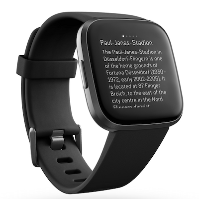

================
Fitbit Wikipedia
================

Fitbit Wikipedia is a small app for your fitbit device to retrieve articles close to your current location. It fetches the 5 closest articles and puts their title and extract to the watch.
You can scroll through the articles by swiping left and right.

.. image:: static/fitbit-wikipedia.png

Furthermore you can change the language of the articles in the settings on your phone.
You can install the app directly from the store:
https://gallery.fitbit.com/details/58693936-da0b-4d6a-8d59-dc6b3f6d1fff

Known limitations
=================

This is the first version of this application and it comes with some shortcomings:

* If the title is too long it exceeds the screen size.
  I didn't find a good way yet as only a limited version of CSS is available
* The wikipedia API is requested with a parameter to limit the amount of sentences.
  The sentence parsing is not very advanced though and labels everything ended by a dot as a sentence.
  Also if it's semantically not a sentence, but. e.g. part of a date (01.01.2020).
  This can lead to interesting texts displayed.
  For now I'm not sure yet how to deal with that as I have to limit the content somehow due to a limited message size between watch and companion app.

Also make sure that the fitbit app has access to your location - even if it runs in the background.On Android: Applications -> Fitbit -> Permissions -> Location -> Always allowed

Building
========

In order to build the app locally you need to install the NPM dependencies::

    npm install

Build the app::

    npx fitbit-build

Install it::

    npx fitbit
    install

To be able to install the app you can either use the Fitbit OS Simulator or your own phone and fitbit device.

Read more about it here:
https://dev.fitbit.com/getting-started/

More info about the building process can be found at:
https://dev.fitbit.com/build/guides/command-line-interface/

Resources
=========

Everything related to developing for fitbit devices can be found here:
https://dev.fitbit.com/

And everything about the Wikipedia API here:
https://www.mediawiki.org/wiki/API:Main_page

Disclaimer
==========

I tested the application in the simulator for all devices, but only own a real Versa 2 device.
I can't guarantee it looks well on other devices.

Also I'm actually a python backend developer and consequently my JS and *making things look nice* experience is very limited.

License
=======

Logo is taken from: https://de.wikipedia.org/wiki/Datei:Wikipedia_svg_logo.svg.
Logo and brand "Wikipedia" are protected with the creative commons license: 
https://creativecommons.org/licenses/by/2.0/
